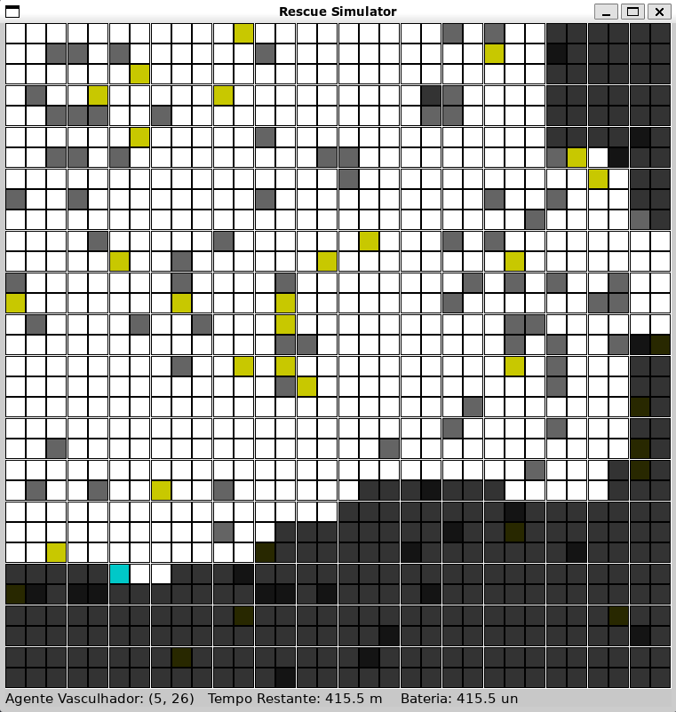

<h1 align="center">Rescue Simulator</h1>

<p align="center">
    
</p>

## Descrição de Projeto 

<p align="center">Esse projeto consiste em um ambiente com vítimas e paredes bem definidos, onde um agente tem que procurar as vítimas no cenário desconhecido e outro agente precisa entregar, de maneira eficiente, pacotes de suprimento. Esse trabalho foi realizado por Gustavo Guedes e Henrique Vanin pela cadeira de Sistemas Inteligentes</p>

## Execução
```bash
#Instalação do pygame para renderizar a parte gráfica
$ pip install pygame

#Arquivo principal executa o game utilizando python3.7+
$ python main.py
```

## Funcionamento

### Ambiente
É dado para ser criado um abiente de tamanho NxM com informações bem definidas de quais coordenadas tem parede e quais tem vítimas. 

### Agente Vasculhador
O Agente Socorrista a cada interação faz uma busca em largura entre os blocos conhecidos e blocos desconhecidos que estão na fronteira dos blocos conhecidos. Também é feito uma busca em largura para saber o custo de cada bloco para a base. \
A escolha do bloco que o agente irá visitar é feita na seguinte ordem:
1. O bloco desconhecido mais próximo do Agente;
2. Em caso de empate, o bloco desconhecido mais próximo da Base;
3. Em caso de empate, as direções "N", "S", "E", "W" , "NE", "SE", "NW", "SW";

### Agente Socorrista
O Agente Socorrista recebe quais foram os estados visitados pelo Agente Vasculhador e uma lista de vítimas achadas por ele. O Agente Socorrista faz um grafo completo entre todas as vítimas e base, depois o Agente sempre escolhe ir para o nó de menor curto da posição atual onde ele está.